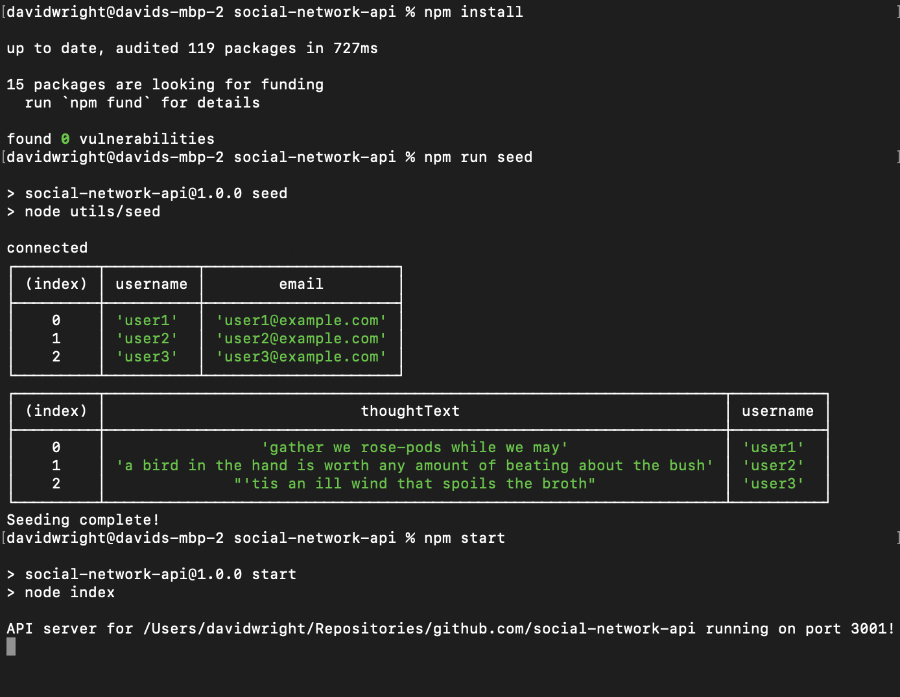
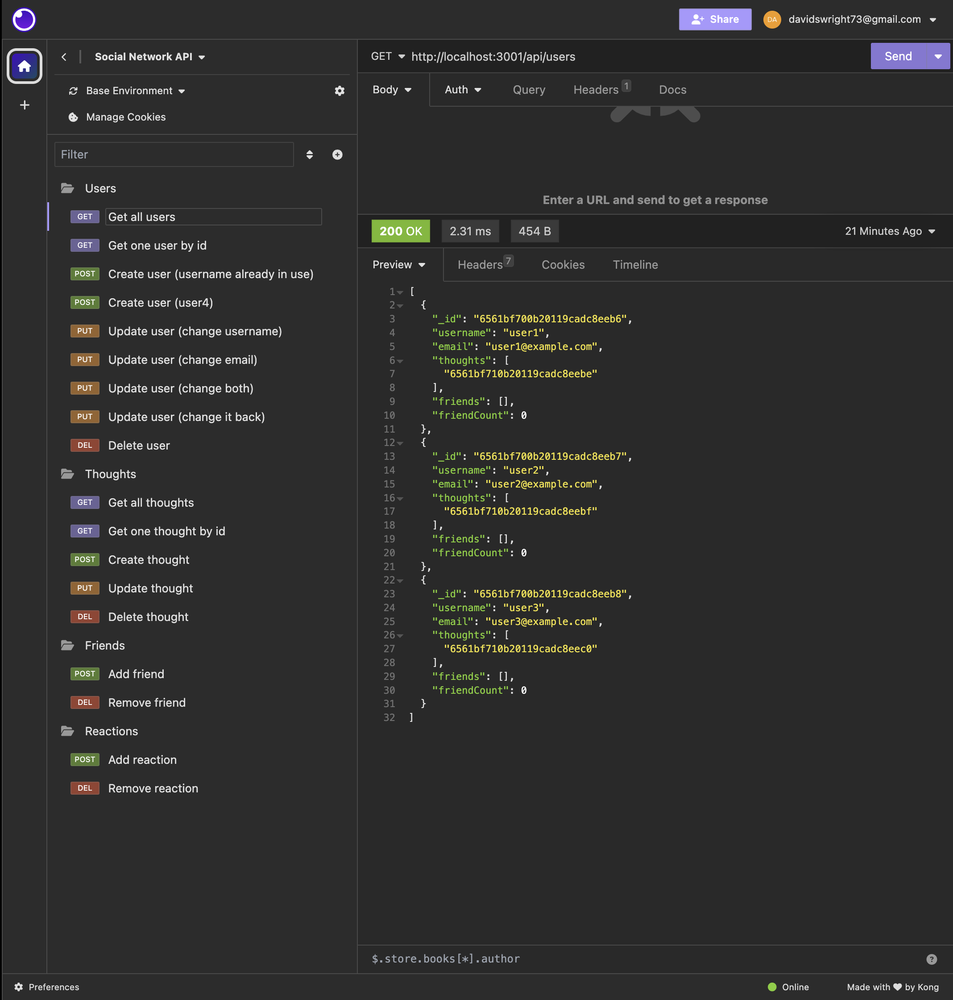

# Social Network API

## Description 

Your GitHub profile is an extremely important aspect of your public identity as a developer. A well-crafted one allows you to show off your work to other developers as well as potential employers. An important component of your GitHub profile—and one that many new developers often overlook—is the README.md file.

The quality of a README often differentiates a good project from a bad project. A good one takes advantage of the opportunity to explain and showcase what your application does, justify the technologies used, and even talk about some of the challenges you faced and features you hope to implement in the future. A good README helps you stand out among the large crowd of developers putting their work on GitHub.

There's no one right way to structure a good README. There is one very wrong way, however, and that is to not include a README at all or to create a very anemic one. This guide outlines a few best practices. As you progress in your career, you will develop your own ideas about what makes a good README.

At a minimum, your project README needs a title and a short description explaining the what, why, and how. What was your motivation? Why did you build this project? (Note: The answer is not "Because it was a homework assignment.") What problem does it solve? What did you learn? What makes your project stand out? 

A video walkthrough demonstrating API functionality and CRUD operations using [Insomnia](https://insomnia.rest/) is available [here](https://watch.screencastify.com/v/qQQh7IQ5dYfWBdVNudDg).


## Installation

Copy the files and folders from the repo into the desired directory.

From the root folder, install dependencies with the command
```
npm install
```


## Usage 

To seed the database, from the root folder use the command
```
npm run seed
```
To start the server, use the command
```
npm start
```
The result of these commands is shown below.



Once the server is listening, the API functionality can be tested using [Insomnia](https://insomnia.rest/), as shown below.




## Credits

I used [Express](https://www.npmjs.com/package/express/v/4.18.2) to manage routing .

I used [Mongoose](https://www.npmjs.com/package/mongoose/v/8.0.1) for MongoDB object modeling.

I used [nodemon](https://www.npmjs.com/package/nodemon/v/3.0.1) for automatic server restart during development testing.


## License

Please refer to the LICENSE in the repo.


---
